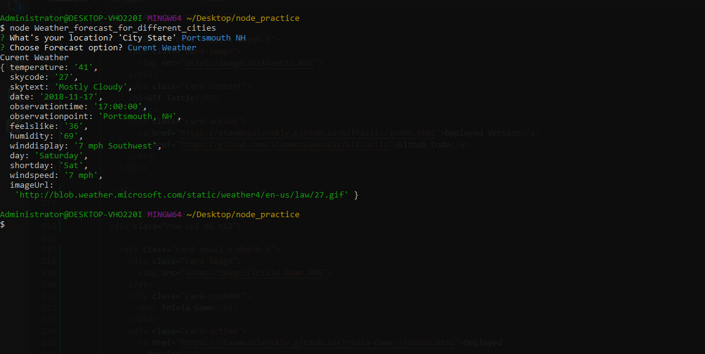

## node Weather forecast

 #### This is not web based application and fully runes in NODE enviroment 

 - First install required node packages by running `npm init y` command in node to the root folder
 - Then run `node Weather-Forecast-npm.js` and answer basic questions: The location and the weather you would like to know.
 
   
 
